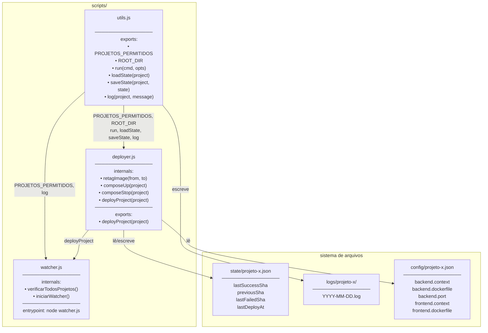
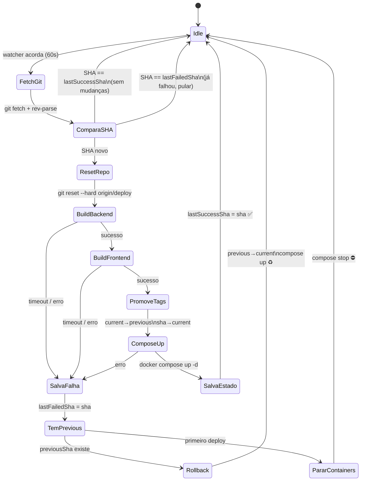
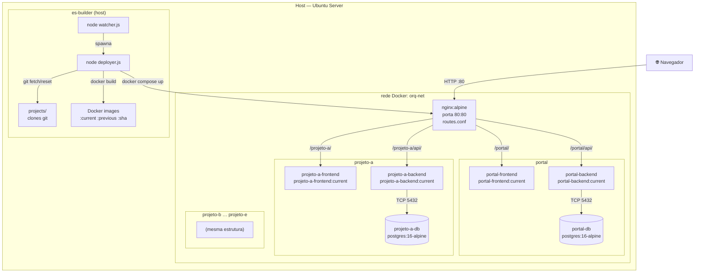
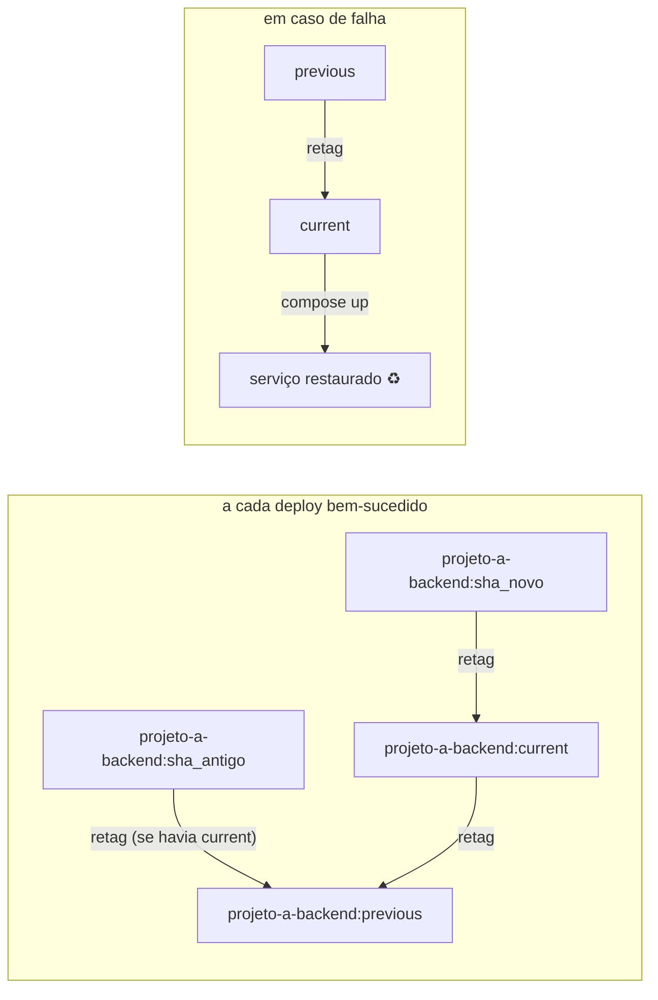

# Arquitetura do ES-Builder

Este documento descreve a estrutura do projeto em três visões complementares.

> O orquestrador é escrito em JavaScript funcional — sem classes ou orientação a objetos.
> O equivalente ao diagrama de classes aqui é o **diagrama de módulos**: o que cada script
> exporta, o que importa e quais funções contém.

---

## 1. Módulos e dependências (equivalente ao diagrama de classes)

---

## 2. Fluxo do deploy (máquina de estados)

---

## 3. Arquitetura de containers e rede

---

## 4. Ciclo de vida de uma imagem Docker

---

## 5. Responsabilidade de cada arquivo

| Arquivo | Camada | Responsabilidade |
|---------|--------|-----------------|
| `scripts/utils.js` | Utilitários | Shell, I/O de estado e log |
| `scripts/deployer.js` | Orquestração | Lógica de deploy, build e rollback |
| `scripts/watcher.js` | Agendamento | Loop de polling e disparo de deploys |
| `scripts/setup.sh` | Bootstrap | Clone de repos, criação de envs, subir Nginx |
| `bootstrap.sh` | Instalação | Dependências do SO, SSH key, clone do orquestrador |
| `docker-compose.yml` | Infraestrutura | Rede `orq-net` e container Nginx |
| `compose/projeto-x.yml` | Infraestrutura | Containers backend, frontend e db por projeto |
| `nginx/conf.d/routes.conf` | Roteamento | Strip de prefixo e proxy reverso |
| `config/projeto-x.json` | Configuração | Paths de Dockerfile e porta por projeto |
| `envs/projeto-x.env` | Configuração | Variáveis de ambiente por projeto (não versionado) |
| `state/projeto-x.json` | Estado | SHAs de deploy por projeto (não versionado) |
